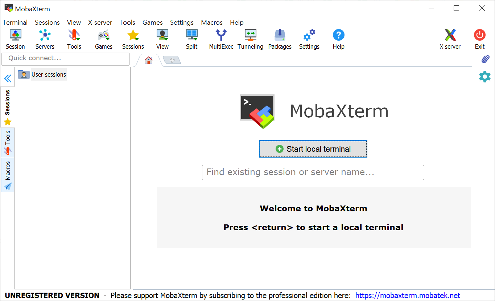

* Draft: 2021-01-18 (Mon)
# PuTTy vs. MobaXTerm
윈도우즈용으로 인기있는 SSH 클라이언트 프로그램인 MobaXTerm과 원조 프로그램인 PuTTy에 관한 내용입니다.

## 개요
* PuTTY는 CLI (Command Line Interface)만 제공합니다.
* GUI를 별도 설치해야 합니다.
* 유사 프로그램인 MobaXTerm는 CLI와 GUI를 한번에 설치해주므로 편리합니다.

## PuTTy와 유사한 프로그램
* 구글에서 `Putty alternatives`로 검색하면 유사한 프로그램이 많이 나옵니다.

## MobaXTerm
* 그 중에서 `MobaXTerm` 무료판의 특징입니다. 

```text
Full X server and SSH support
Remote desktop (RDP, VNC, Xdmcp)
Remote terminal (SSH, telnet, rlogin, Mosh)
X11-Forwarding
Automatic SFTP browser
Master password protection
Plugins support
Portable and installer versions
Full documentation
Max. 12 sessions
Max. 2 SSH tunnels
Max. 4 macros
Max. 360 seconds for Tftp, Nfs and Cron
```

설치 후 프로그램을 실행했을 때의 화면입니다.


