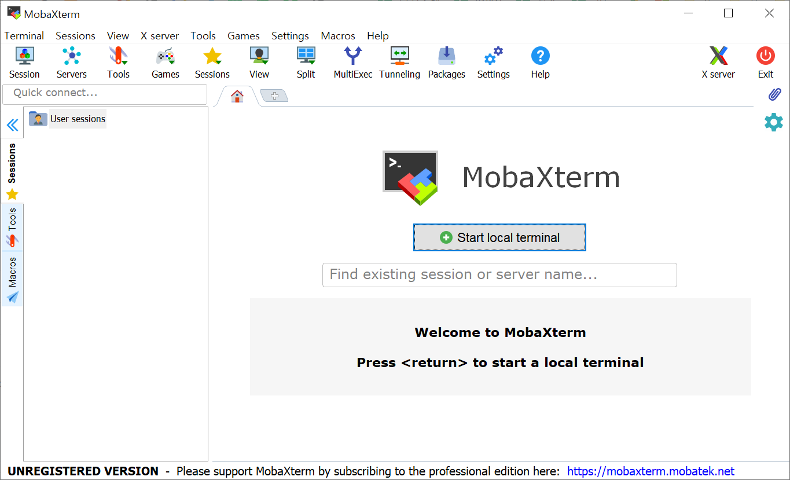

* Draft: 2021-01-18 (Mon)
# 설치하기: PuTTy vs. MobaXTerm
* PuTTY는 CLI (Command Line Interface)만 제공한 후, GUI를 별도 설치해야 합니다.
* MobaXTerm는 CLI와 GUI를 한번에 설치해주므로 편리합니다.

## 윈도우즈10에 PuTTY 설치하기
[Download PuTTY](https://www.chiark.greenend.org.uk/~sgtatham/putty/latest.html)에서 MSI (‘Windows Installer’)를 다운로드해서 설치합니다.
* 64-bit: [putty-64bit-0.74-installer.msi](https://the.earth.li/~sgtatham/putty/latest/w64/putty-64bit-0.74-installer.msi)

## 윈도우즈10에 `MobaXTerm`를 설치해봅니다. 
* [MobaXterm free Xserver and tabbed SSH client for Windows](https://mobaxterm.mobatek.net/)
* [Download](https://mobaxterm.mobatek.net/download.html)
  * [MobaXterm Home Edition v20.6 (Installer edition)](https://download.mobatek.net/2062020111930940/MobaXterm_Installer_v20.6.zip)
* 링크를 클릭하면 `MobaXterm_Installer_v20.6.zip`와 같은 프로그램을 다운로드 받을 수 있습니다. 
* 압축을 해제한 후 설치를 진행합니다.
* 설치 후 프로그램을 실행했을 때의 화면입니다.

