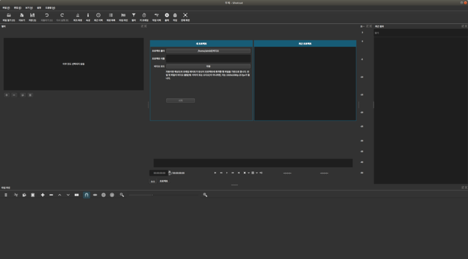

* Rev.1: 2020-06-24 (Wed)
* Draft: 2019-09-13 (Fri)

# Shotcut
우분투 리눅스에서 비디오 편집 프로그램을 설치해봅니다. [Best Free Video Editing Software for Linux](https://itsfoss.com/best-video-editing-software-linux/)의 3번째인 Shotcut을 선택했는데, 이유는 Cross-platform으로 Windows, MAC에서도 사용 가능하기 때문입니다. 단점은 너무 많은 기능이 있어서 복잡하다는 것.

​

Shotcut is a free, open source, cross-platform video editor. Download 페이지에 있는 설치 명령어 중 snap을 실행해봅니다. 
https://www.shotcut.org/download/

$ snap install shotcut --classic

설치가 완료된 후 실행하면

## References
* [[비디오 편집] Shotcut 설치](https://m.blog.naver.com/PostView.nhn?blogId=aimldl&logNo=221646863794&referrerCode=0&searchKeyword=linux)
