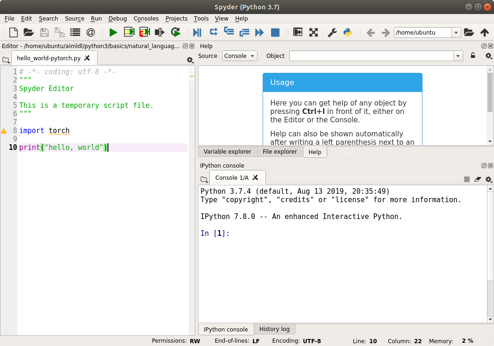
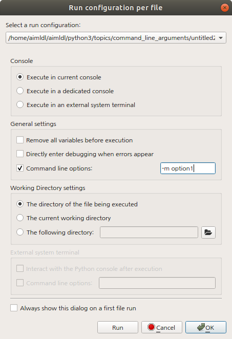

##### aimldl > computing_environments > spyder > README.md


### Spyder

### Usage
> Here you can get help of any object by pressing Ctrl+I in front of it, either on the Editor or the Console.
Help can also be shown automatically after writing a left parenthesis next to an object. You can activate this behavior in Preferences > Help.
New to Spyder? Read our tutorial

#### Running Spyder on AWS EC2 Instance

Use the -X option to connect an EC2 instance which enables X-Windows forwarding. Assuming Anaconda is installed, the following command opens Spyder on the local machine (when X-Windows system is enabled on the local machine).
```bash
(base) ubuntu@ec2-gpu:~$ spyder &
[1] 16249
```


The default directory is "/home/ubuntu" which is identical to the 'pwd' result in the remote EC2 instance.

On the IPython console on the right bottom, let's run some commands to make sure this Spyder opens locally, but runs remotely on the EC2 instance. Make sure to type in the leading "!" before ls and hostname.
```bash
In [1]: !ls
Anaconda3-2019.10-Linux-x86_64.sh  README  anaconda3  src
Nvidia_Cloud_EULA.pdf              aimldl  embedding  tools

In [2]: !hostname
ip-x-x-x-x

In [3]:
```

On the remote server or the EC2 instance, type in 'cd && pwd' and 'hostname' to check the home directory and the host name, respectively.
```bash
(base) ubuntu@ec2-gpu:~$ cd && pwd
/home/ubuntu
(base) ubuntu@ec2-gpu:~$ hostname
ip-x-x-x-x
(base) ubuntu@ec2-gpu:~$
```
These results on the EC2 instance match those on Spyder.

Now save the following hello world script on the EC2 instance (on /home/ubuntu) and open it on Spyder.
```Python
# hello_world-pytorch.py
import torch

print("hello, world")
```
On Spyder, click "Run > Run" menu, "Run file" button, or press F5. The output on the IPython console is:
```bash
In [3]: runfile('/home/ubuntu/hello_world-pytorch.py', wdir='/home/ubuntu')
hello, world
```
 Now we have just tested that Spyder is open locally, but the IPython console runs remotely on the EC2 instance.

#### [Passing Arguments to Spyder for debugging file](https://stackoverflow.com/questions/53628850/passing-arguments-to-spyder-for-debugging-file)


> Go to run > configure
Tick command line options and type in the arguments in the space.

</img>
