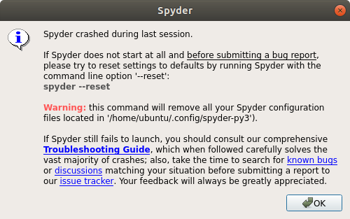
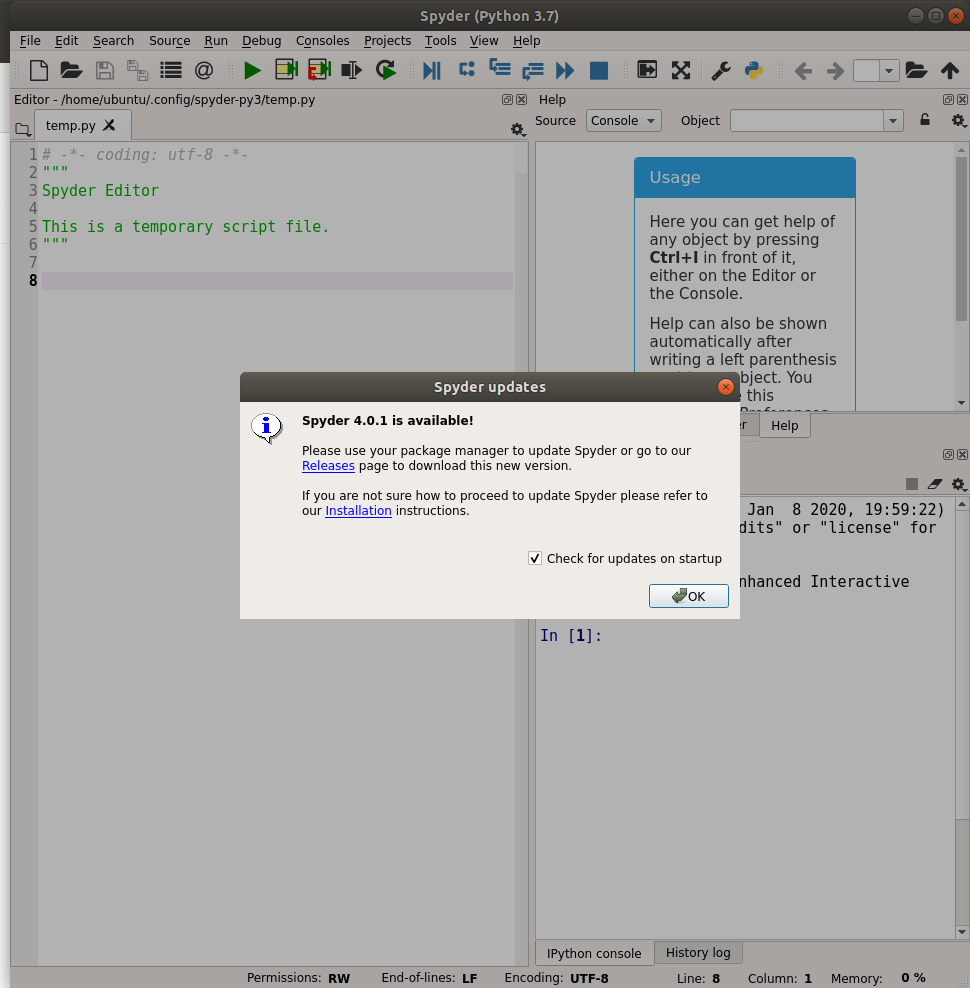

##### aimldl/computing_environments/spyder/TROUBLESHOOT.md

## Troubleshooting Spyder

### Summary
The problem "ModuleNotFoundError: No module named 'IPython.core.inputtransformer2'" is solved by removing the existing Conda virtual environment and re-create/reinstall it.

### Problem
ModuleNotFoundError: No module named 'IPython.core.inputtransformer2'



```bash
(pytorch) ubuntu@ec2-seoul-aimldl:~$ spyder &
[1] 89534
(pytorch) ubuntu@ec2-seoul-aimldl:~$ Traceback (most recent call last):
  File "/home/ubuntu/anaconda3/envs/pytorch/lib/python3.7/site-packages/spyder/app/mainwindow.py", line 3711, in main
    mainwindow = run_spyder(app, options, args)
  File "/home/ubuntu/anaconda3/envs/pytorch/lib/python3.7/site-packages/spyder/app/mainwindow.py", line 3552, in run_spyder
    main.setup()
  File "/home/ubuntu/anaconda3/envs/pytorch/lib/python3.7/site-packages/spyder/app/mainwindow.py", line 1010, in setup
    from spyder.plugins.ipythonconsole.plugin import IPythonConsole
  File "/home/ubuntu/anaconda3/envs/pytorch/lib/python3.7/site-packages/spyder/plugins/ipythonconsole/plugin.py", line 52, in <module>
    from spyder.plugins.ipythonconsole.widgets import ClientWidget
  File "/home/ubuntu/anaconda3/envs/pytorch/lib/python3.7/site-packages/spyder/plugins/ipythonconsole/widgets/__init__.py", line 16, in <module>
    from .debugging import DebuggingWidget
  File "/home/ubuntu/anaconda3/envs/pytorch/lib/python3.7/site-packages/spyder/plugins/ipythonconsole/widgets/debugging.py", line 22, in <module>
    from IPython.core.inputtransformer2 import TransformerManager
ModuleNotFoundError: No module named 'IPython.core.inputtransformer2'
(pytorch) ubuntu@ec2-seoul-aimldl:~$
```

### Attempts
* Google search: ModuleNotFoundError: No module named 'IPython.core.inputtransformer2'
* [ImportError: No module named IPython](https://stackoverflow.com/questions/45179915/importerror-no-module-named-ipython)

```bash
$ ipython --version
6.5.0
$
```

```bash
$ pip install ipython
Requirement already satisfied: ipython in ./anaconda3/envs/pytorch/lib/python3.7/site-packages (6.5.0)
  ...
$
```

```bash
$ conda install -c anaconda ipython
Collecting package metadata (current_repodata.json): done
Solving environment: done

## Package Plan ##

  environment location: /home/ubuntu/anaconda3/envs/pytorch

  added / updated specs:
    - ipython


The following packages will be downloaded:

    package                    |            build
    ---------------------------|-----------------
    ca-certificates-2019.11.27 |                0         132 KB  anaconda
    certifi-2019.11.28         |           py37_0         156 KB  anaconda
    ipython-5.8.0              |           py37_0         1.0 MB  anaconda
    openssl-1.1.1              |       h7b6447c_0         5.0 MB  anaconda
    ------------------------------------------------------------
                                           Total:         6.3 MB

The following packages will be UPDATED:

  openssl              pkgs/main::openssl-1.1.1d-h7b6447c_3 --> anaconda::openssl-1.1.1-h7b6447c_0

The following packages will be SUPERSEDED by a higher-priority channel:

  ca-certificates                                 pkgs/main --> anaconda
  certifi                                         pkgs/main --> anaconda
  ipython                   pkgs/main::ipython-6.5.0-py37_0 --> anaconda::ipython-5.8.0-py37_0


Proceed ([y]/n)? y
  ...
$
```
```bash
$ sudo apt-get install spyder
```
```bash
$ spyder --reset
*** Reset Spyder settings to defaults ***
removing: /home/ubuntu/.config/spyder-py3/onlinehelp
removing: /home/ubuntu/.config/spyder-py3/spyder.ini
removing: /home/ubuntu/.config/spyder-py3/temp.py
removing: /home/ubuntu/.config/spyder-py3/template.py
removing: /home/ubuntu/.config/spyder-py3/history.py
removing: /home/ubuntu/.config/spyder-py3/history_internal.py
removing: /home/ubuntu/.config/spyder-py3/workingdir
removing: /home/ubuntu/.config/spyder-py3/.ropeproject
removing: /home/ubuntu/.config/spyder-py3/langconfig
removing: /home/ubuntu/.config/spyder-py3/spyder.lock
removing: /home/ubuntu/.config/spyder-py3/config/spyder.ini
removing: /home/ubuntu/.config/spyder-py3/config/transient.ini
removing: /home/ubuntu/.config/spyder-py3/lsp_root_path
removing: /home/ubuntu/.config/spyder-py3/plugins
$
```
All of the attempts failed.

### Hint
I switch back to the base environment and Spyder launches without a problem. Can this be a hint to solve this problem?

```bash
(pytorch) ubuntu@ec2-seoul-aimldl:~$ conda deactivate
(base) ubuntu@ec2-seoul-aimldl:~$ spyder &
[1] 95086
(base) ubuntu@ec2-seoul-aimldl:~$ 
```
I switched to another Conda environment pytorch_audio and Spyder launches without a problem. I'm sure I can fix it.
```bash
(base) ubuntu@ec2-seoul-aimldl:~$ conda info -e
# conda environments:
#
base                  *  /home/ubuntu/anaconda3
pytorch                  /home/ubuntu/anaconda3/envs/pytorch
pytorch_audio            /home/ubuntu/anaconda3/envs/pytorch_audio

(base) ubuntu@ec2-seoul-aimldl:~$ conda activate pytorch_audio
(pytorch_audio) ubuntu@ec2-seoul-aimldl:~$ spyder &
(pytorch_audio) ubuntu@ec2-seoul-aimldl:~$
```
### Solution
I uninstalled the existing Conda virtual environment and reinstalled a new environment. Spyder launches normally without any problem. Something must be wrong when the old Conda environment is created. The commands to fix this problem are below.

First, uninstall the existing pytorch Conda environment.
```bash
(pytorch) ubuntu@ec2-seoul-aimldl:~$ conda deactivate
(base) ubuntu@ec2-seoul-aimldl:~$ conda env remove -n pytorch
```
To verify the removal, run either "conda info -e" or "conda info --envs".
```bash
(base) ubuntu@ec2-seoul-aimldl:~$ conda info --envs
# conda environments:
#
base                  *  /home/ubuntu/anaconda3
pytorch_audio            /home/ubuntu/anaconda3/envs/pytorch_audio
```
After the removal, it's impossible to activate pytorch Conda environment.
```bash
(base) ubuntu@ec2-seoul-aimldl:~$ conda activate pytorch
Could not find conda environment: pytorch
You can list all discoverable environments with `conda info --envs`.

(base) ubuntu@ec2-seoul-aimldl:~$ 
```
As a next step, re-create pytorch Conda environment. Make sure to include anaconda.

```bash
(base) ubuntu@ec2-seoul-aimldl:~$ conda create -n pytorch python=3 anaconda
Collecting package metadata (current_repodata.json): done
Solving environment: done

## Package Plan ##

  environment location: /home/ubuntu/anaconda3/envs/pytorch

  added / updated specs:
    - anaconda
    - python=3


The following packages will be downloaded:
    ...
  spyder             pkgs/main/linux-64::spyder-3.3.6-py37_0
  spyder-kernels     pkgs/main/linux-64::spyder-kernels-0.5.2-py37_0
    ...

Proceed ([y]/n)? y
    ...
(base) ubuntu@ec2-seoul-aimldl:~$ 
```
In the long list of packages, spyder and spyder-kernels do exist. After the installation is completed, let's check if spyder launches without a problem.
```bash
(base) ubuntu@ec2-seoul-aimldl:~$ conda activate pytorch
(pytorch) ubuntu@ec2-seoul-aimldl:~$ spyder &
[1] 102613
(pytorch) ubuntu@ec2-seoul-aimldl:~$
```
Spyder launches successfully!


### Install the Pytorch Package
Now let's install the Pytorch package in the pytorch Conda environment.
```bash
(pytorch) ubuntu@ec2-seoul-aimldl:~$ conda install pytorch torchvision cudatoolkit=10.0 -c pytorch
Collecting package metadata (current_repodata.json): done
Solving environment: done

## Package Plan ##

  environment location: /home/ubuntu/anaconda3/envs/pytorch

  added / updated specs:
    - cudatoolkit=10.0
    - pytorch
    - torchvision


The following NEW packages will be INSTALLED:

  cudatoolkit        pkgs/main/linux-64::cudatoolkit-10.0.130-0
  ninja              pkgs/main/linux-64::ninja-1.9.0-py37hfd86e86_0
  pytorch            pytorch/linux-64::pytorch-1.4.0-py3.7_cuda10.0.130_cudnn7.6.3_0
  torchvision        pytorch/linux-64::torchvision-0.5.0-py37_cu100


Proceed ([y]/n)? 
   ...
```
To verify the installation, run:
```bash
(pytorch) ubuntu@ec2-seoul-aimldl:~$ python
Python 3.7.6 (default, Jan  8 2020, 19:59:22) 
[GCC 7.3.0] :: Anaconda, Inc. on linux
Type "help", "copyright", "credits" or "license" for more information.
>>> import torch
>>> exit()
(pytorch) ubuntu@ec2-seoul-aimldl:~$
```
Pytorch has been installed successfully! For details about the Conda installation, refer to [computing_environments/anaconda/INSTALL.md](https://github.com/aimldl/computing_environments/blob/master/anaconda/INSTALL.md).
