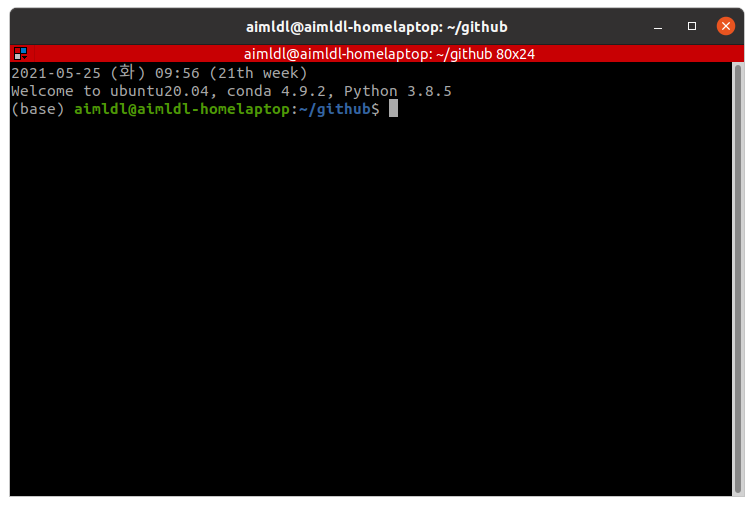

* Draft: 2021-05-25 (Tue)

# Terminator 설치하기

## Ubuntu 설치 명령어

```bash
sudo add-apt-repository ppa:gnome-terminator
sudo apt update
sudo apt install -y terminator
```

자세한 내용은 [Terminator > Installation > Linux Distributions > Ubuntu](https://gnometerminator.blogspot.com/p/introduction.html)를 참고하세요.

## 설치 확인

```bash
$ terminator &
```

를 입력하면 새로운 터미네이터 창이 팝업됩니다.




