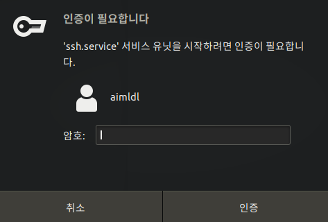

* Draft: 2020-12-09 (Wed)

# 우분투 리눅스에 `sshd` 서버 설치하는 방법

## 개요

* 컴퓨터 (혹은 서버)에 sshd (SSH Daemon) 서버가 실행되고 있으면, ssh명령어를 써서 원격에서 접속할 수 있습니다. 
* sshd를 설치하는 방법을 알아봅니다.
* 참고 문서:
  * Google search: sshd 설정 우분투 18.04
  * [[Linux] Ubuntu 18.04 SSH서버 구축하기 및 SSH Root 계정 접속 설정 (Ubuntu OpenSSH Server)](https://antdev.tistory.com/48)

## Google search
ubuntu 20.04 ssh 설치

* [우분투 데스크탑 sshd server 활성화](https://www.lesstif.com/lpt/sshd-server-24445601.html)

## 설치 (Install)

Step 1. `openssh-server`를 설치합니다.

```bash
$ sudo apt install -y openssh-server
```

설치는 쉽게 완료됩니다. 

Step 2. `sshd`을 활성화합니다.

```bash
$ service ssh start
```
팝업 윈도우가 뜨면 암호를 입력합니다.



위의 `service` 명령어 외에 `systemctl` 명령어로도 활성화할 수 있습니다.

```bash
$ sudo systemctl enable sshd
```

Step 3. 이 컴퓨터의 IP주소를 알아냅니다.

```bash
$ ifconfig | grep 'inet '
        inet 123.456.7.8  netmask 255.255.255.0  broadcast 123.456.7.255
        inet 321.0.0.1  netmask 255.0.0.0
$
```

Step 4. 다른 컴퓨터에서 `ssh` 명령어로 원격접속이 되는지 확인합니다.

리눅스/맥OS의 경우

```bash
$ ssh user_is@123.456.7.8
```

## `sshd`의 설정, 활성화 등

`sshd`를 쓸 때 필요한 몇 가지 명령어들 입니다.

### 설정

```bash
$ sudo nano /etc/ssh/sshd_config
```

`nano`에디터 대신 `vi`에디터 등 다른 에디터를 써도 무관합니다.

자세한 내용은 [SSH 보안 설정](https://www.lesstif.com/ws/ssh-43843905.html)를 참고하세요.

### 활성화

```bash
$ service ssh start
$ sudo systemctl enable sshd
$ sudo systemctl restart sshd
```

### 상태 체크

```bash
$ sudo systemctl status sshd
```

화면 출력은 다음 같습니다.

```bash
● ssh.service - OpenBSD Secure Shell server
   Loaded: loaded (/lib/systemd/system/ssh.service; enabled; vendor preset: enab
   Active: active (running) since Mon 2021-01-18 16:37:30 KST; 12min ago
 Main PID: 23713 (sshd)
    Tasks: 1 (limit: 4915)
   CGroup: /system.slice/ssh.service
           └─23713 /usr/sbin/sshd -D

 1월 18 16:37:30 aimldl-home-desktop systemd[1]: Starting OpenBSD Secure Shell s
 1월 18 16:37:30 aimldl-home-desktop sshd[23713]: Server listening on 0.0.0.0 po
 1월 18 16:37:30 aimldl-home-desktop sshd[23713]: Server listening on :: port 22
 1월 18 16:37:30 aimldl-home-desktop systemd[1]: Started OpenBSD Secure Shell se
lines 1-12/12 (END)...skipping...
● ssh.service - OpenBSD Secure Shell server
   Loaded: loaded (/lib/systemd/system/ssh.service; enabled; vendor preset: enabled)
   Active: active (running) since Mon 2021-01-18 16:37:30 KST; 12min ago
 Main PID: 23713 (sshd)
    Tasks: 1 (limit: 4915)
   CGroup: /system.slice/ssh.service
           └─23713 /usr/sbin/sshd -D

 1월 18 16:37:30 aimldl-home-desktop systemd[1]: Starting OpenBSD Secure Shell server...
 1월 18 16:37:30 aimldl-home-desktop sshd[23713]: Server listening on 0.0.0.0 port 22.
 1월 18 16:37:30 aimldl-home-desktop sshd[23713]: Server listening on :: port 22.
 1월 18 16:37:30 aimldl-home-desktop systemd[1]: Started OpenBSD Secure Shell server.
```

