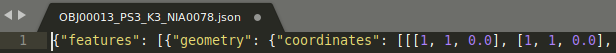
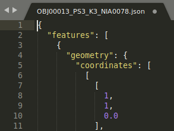
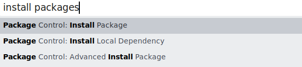
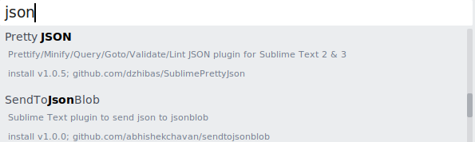
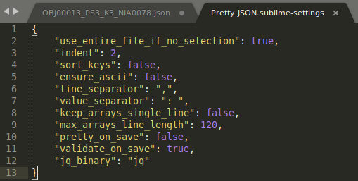

* Draft: 2020-10-08 (Thu)

# How to Install & Use Pretty JSON

## References

* [Sublime Text 3 pretty JSON](https://blog.adriaan.io/sublime-pretty-json.html)
* [Sublime Text에서 JSON 정렬](http://zeany.net/22)

## Introduction to Pretty JSON

When a .json file is opened in Sublime Text, this raw text file is not formatted and hard to read as follows.



A JSON viewer like Pretty JSON helps enhancing the readability as follows when `Ctrl+Alt+J` is pressed.



## Installation

Step 1. Launch Sublime Text

```bash
$ subl
```

Step 2. In the Sublime Text window, open `Package Control: Install Package` by pressing:

> Ctrl+Shift+p




Step 3. Search for `Pretty JSON` by entering the keyword `json`



Step 4. Verify the installation. In the `Preferences > Package Settings menu, `Preferences > Package Settings > Pretty JSON` appears after the installation. The default settings are below.



Step 5. Test the JSON formatter. To convert the format, press 

* Ctrl+Alt+J (Linux, Windows)
* Ctrl+Cmd+J (MAC OSX)