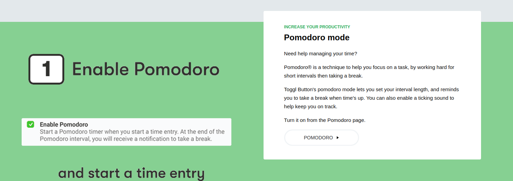

EASY & FAST
Create time entries
Just click the "Play" icon to start tracking your first time entry!

When you're done with your task, click on the "Stop" icon to save your entry.

The Toggl Button popup shows a list of your recent time entries*. You can edit them from here.

You can also enable useful time tracking features like idle detect

chrome-extension://oejgccbfbmkkpaidnkphaiaecficdnfn/images/button-create.gif

SUPERCHARGE YOUR TOOLS
Use integrations
Add Toggl Button to 130+ tools for super fast time tracking!

Once enabled, Toggl Button will show up inside the tool - just click on the Toggl Button icon to start a time entry.

The description (and the project, if possible) will automatically be filled in for you.

Check out the Integrations page now to see if your favourite tools are supported!

INCREASE YOUR PRODUCTIVITY
Pomodoro mode

Need help managing your time?

Pomodoro® is a technique to help you focus on a task, by working hard for short intervals then taking a break.

Toggl Button's pomodoro mode lets you set your interval length, and reminds you to take a break when time's up. You can also enable a ticking sound to help keep you on track.

Turn it on from the Pomodoro page.

