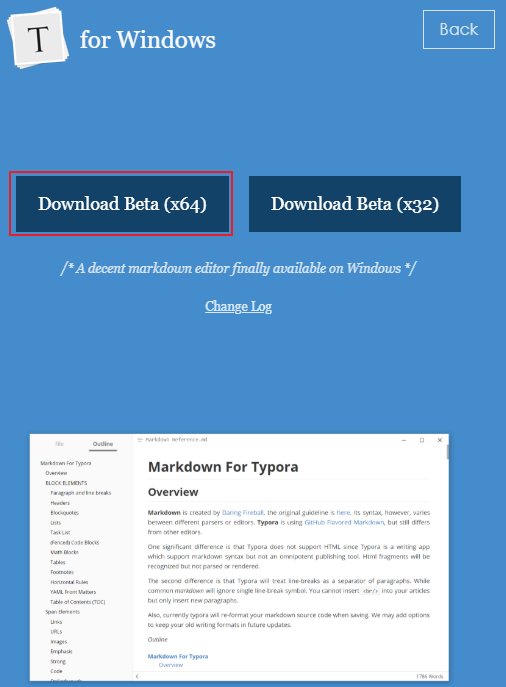
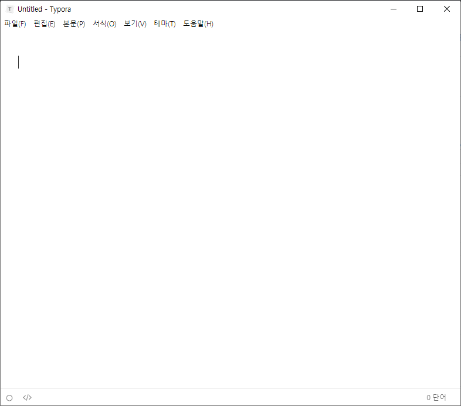

* Rev.3: 2020-06-24 (Wed)
* Rev.2: 2020-03-28 (Sat)
* Rev.1: 2020-03-24 (Tue)
* Draft: 2020-01-20 (Mon)

# INSTALL
## Install Typora on Ubuntu Linux (18.04)

Download and run [install_typora](bash_scripts/install_typora).
```bash
$ chmod +x install_typora
$ ./install_typora
```
Equivalently, run the following commands.

```bash
# or use
# sudo apt-key adv --keyserver keyserver.ubuntu.com --recv-keys BA300B7755AFCFAE
wget -qO - https://typora.io/linux/public-key.asc | sudo apt-key add -

# add Typora's repository
sudo add-apt-repository 'deb https://typora.io/linux ./'
sudo apt-get update

# install typora
sudo apt-get install typora
```
These commands are tested on:
* Ubuntu 18.04 on a GPU desktop
* Ubuntu 18.04 on an EC2 instance
* Ubuntu 18.04 on a Docker image/container
For details, refer to [Install Typora on Linux](https://support.typora.io/Typora-on-Linux/).

### Install add-apt-repository if necessary
If "sudo add-apt-repository" fails, install the command as follows. While Ubuntu Linux includes this command by default, Docker's Ubuntu image doesn't have it. So install the command if you choose to install Typora on Docker's Ubuntu image/container.
```bash
$ sudo add-apt-repository 'deb https://typora.io/linux ./'
sudo: add-apt-repository: command not found
$ sudo apt-get install software-properties-common
$
```
"add-apt-repositor" should work now. That is,
```bash
$ sudo apt-get install software-properties-common
```
For details, refer to [Fix ‘add-apt-repository command not found’ Error on Ubuntu and Debian](https://itsfoss.com/add-apt-repository-command-not-found/) and/or [How to Add Apt Repository in Ubuntu & Debian](https://phoenixnap.com/kb/add-apt-repository-command-not-found-ubuntu).

### Verify installation
```bash
$ which typora
/usr/bin/typora
$
```

If typora is not installed properly, the `Command not found` error will occur.
```bash
$ typora
typora: command not found
$
```

## Uninstall Typora from Ubuntu Linux
```bash
$ sudo apt remove typora
$ sudo apt autoremove
```
For example, remove typora from Ubuntu 18.04 (on an EC2 instance)
```bash
$ sudo apt remove typora
Reading package lists... Done
  ...
Do you want to continue? [Y/n] y
  ...
Processing triggers for mime-support (3.60ubuntu1) ...
$ sudo apt autoremove
  ...
$
```
## Install Typora on Windows
Download the installation file at https://typora.io/#windows. For Windows 10 (64bit), click (x64).


Run the downloaded executable file "typora-setup-x64.exe". The installation should go smooth because it's Windows. Launch Typora and it will look like this. (Note my language setting is Korean.)

