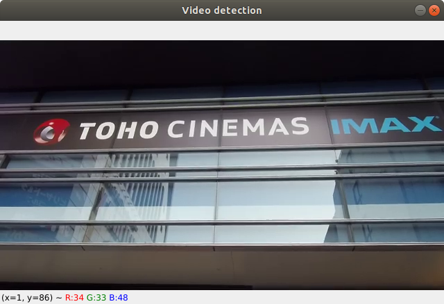
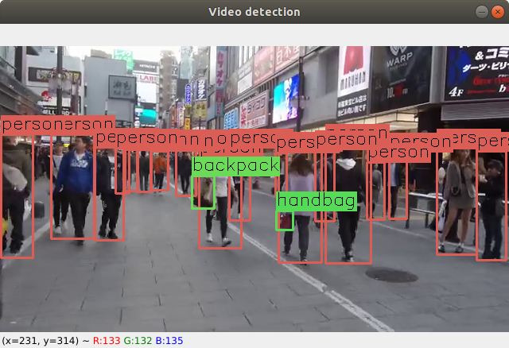

* Draft: 2021-02-02 (Tue)

# Git Repo [heartkilla](https://github.com/heartkilla)/[yolo-v3](https://github.com/heartkilla/yolo-v3)의 오류를 수정해서 동작하도록 만드는 과정

## 개요

* [../install/as_heartkilla_suggests.md](../install/as_heartkilla_suggests.md)의 부록입니다.
  * [heartkilla](https://github.com/heartkilla)/[yolo-v3](https://github.com/heartkilla/yolo-v3)가 이미지 파일에는 동작하지만, 비디오 파일로 테스트를 했을 때 동작하지 않습니다.
  * 발생하는 오류를 수정해서 동작하도록 만드는 과정을 기록합니다.

## Problem

```bash
(yolov3-heartkilla-tensorflow) $ python detect.py video 0.5 0.5 data/video/shinjuku.mp4
```

```bash
  ...
QObject::moveToThread: Current thread (0x55d8cf833e80) is not the object's thread (0x55d8cafbdfb0).
Cannot move to target thread (0x55d8cf833e80)

OpenCV: FFMPEG: tag 0x34363258/'X264' is not supported with codec id 27 and format 'mp4 / MP4 (MPEG-4 Part 14)'
OpenCV: FFMPEG: fallback to use tag 0x31637661/'avc1'
Could not find encoder for codec id 27: Encoder not found
OMP: Info #252: KMP_AFFINITY: pid 8809 tid 8881 thread 1 bound to OS proc set 1
  ...
OMP: Info #252: KMP_AFFINITY: pid 8809 tid 8928 thread 21 bound to OS proc set 9
ASSERT: "false" in file qasciikey.cpp, line 501
중지됨 (core dumped)
$
```

## Hint

Google search: anaconda "OpenCV: FFMPEG: tag 0x34363258/'X264' is not supported with codec id 27 and format 'mp4 / MP4 (MPEG-4 Part 14)'"

* [C++ OpenCV 3.4 / FFMPEG 3.4.1 VideoWriter and MP4](https://www.manongdao.com/article-1097949.html)

(최근에 OS를 재설치해서)`ffmpeg`이 설치되지 않았음을 깨달았습니다. 

```bash
$ ffmpeg

Command 'ffmpeg' not found, but can be installed with:

sudo snap install ffmpeg  # version 4.3.1, or
sudo apt  install ffmpeg

See 'snap info ffmpeg' for additional versions.

$
```

## Solution

`ffmpeg`을 설치해서 문제를 해결했습니다.

```bash
$ sudo apt install -y ffmpeg
  ...
$
```

명령어를 실행하니 잘 동작합니다.

``` bash
(yolov3-heartkilla-tensorflow) $ python detect.py video 0.5 0.5 data/video/shinjuku.mp4

  ...
OpenCV: FFMPEG: tag 0x34363258/'X264' is not supported with codec id 27 and format 'mp4 / MP4 (MPEG-4 Part 14)'
OpenCV: FFMPEG: fallback to use tag 0x31637661/'avc1'
Could not find encoder for codec id 27: Encoder not found
OMP: Info #252: KMP_AFFINITY: pid 10491 tid 10524 thread 1 bound to OS proc set 1
OMP: Info #252: KMP_AFFINITY: pid 10491 tid 10552 thread 2 bound to OS proc set 2
OMP: Info #252: KMP_AFFINITY: pid 10491 tid 10553 thread 3 bound to OS proc set 3
OMP: Info #252: KMP_AFFINITY: pid 10491 tid 10554 thread 4 bound to OS proc set 4
OMP: Info #252: KMP_AFFINITY: pid 10491 tid 10555 thread 5 bound to OS proc set 5
OMP: Info #252: KMP_AFFINITY: pid 10491 tid 10556 thread 6 bound to OS proc set 6
OMP: Info #252: KMP_AFFINITY: pid 10491 tid 10557 thread 7 bound to OS proc set 7
OMP: Info #252: KMP_AFFINITY: pid 10491 tid 10558 thread 8 bound to OS proc set 8
OMP: Info #252: KMP_AFFINITY: pid 10491 tid 10559 thread 9 bound to OS proc set 9
OMP: Info #252: KMP_AFFINITY: pid 10491 tid 10560 thread 10 bound to OS proc set 10
OMP: Info #252: KMP_AFFINITY: pid 10491 tid 10561 thread 11 bound to OS proc set 11
OMP: Info #252: KMP_AFFINITY: pid 10491 tid 10562 thread 12 bound to OS proc set 0
OMP: Info #252: KMP_AFFINITY: pid 10491 tid 10525 thread 13 bound to OS proc set 1
OMP: Info #252: KMP_AFFINITY: pid 10491 tid 10563 thread 14 bound to OS proc set 2
OMP: Info #252: KMP_AFFINITY: pid 10491 tid 10564 thread 15 bound to OS proc set 3
OMP: Info #252: KMP_AFFINITY: pid 10491 tid 10565 thread 16 bound to OS proc set 4
OMP: Info #252: KMP_AFFINITY: pid 10491 tid 10566 thread 17 bound to OS proc set 5
OMP: Info #252: KMP_AFFINITY: pid 10491 tid 10567 thread 18 bound to OS proc set 6
OMP: Info #252: KMP_AFFINITY: pid 10491 tid 10568 thread 19 bound to OS proc set 7
OMP: Info #252: KMP_AFFINITY: pid 10491 tid 10569 thread 20 bound to OS proc set 8
OMP: Info #252: KMP_AFFINITY: pid 10491 tid 10572 thread 23 bound to OS proc set 11
OMP: Info #252: KMP_AFFINITY: pid 10491 tid 10570 thread 21 bound to OS proc set 9
OMP: Info #252: KMP_AFFINITY: pid 10491 tid 10573 thread 24 bound to OS proc set 0
OMP: Info #252: KMP_AFFINITY: pid 10491 tid 10571 thread 22 bound to OS proc set 10(yolov3-heartkilla-tensorflow) 
```

## Result

아래의 창이 생겨서 영상의 앞부분이 재생됩니다.

(yolov3-heartkilla-tensorflow) 

조금 기다리면 사물이 검출되는 화면을 볼 수 있습니다.



* 영상이 재생되는 창을 닫아도 다시 열립니다.

* 중간에 빠져나가려면 터미널에서 `Ctrl+c`를 누르세요.

```bash
^CDetections have been saved successfully.
(yolov3-heartkilla-tensorflow) $
```

사물 검출된 영상을 저장하려면 마지막까지 기다리시면 됩니다.
