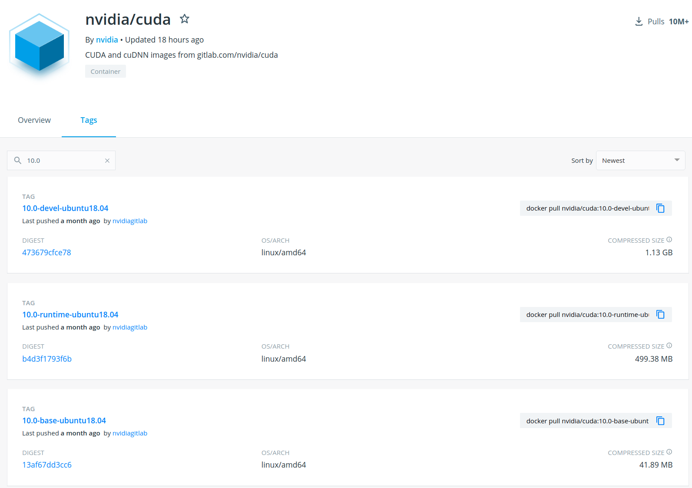
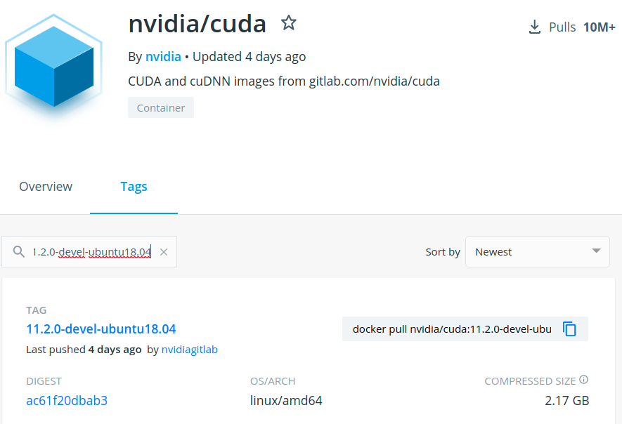

* Rev.1: 2021-02-14 (Sun)
* Draft: 2021-02-09 (Tue)

# CUDA와 CUDNN이 설치된 도커 이미지 생성하기

## 요약

* [nvidia/cuda - Docker Hub](https://hub.docker.com/r/nvidia/cuda/)에 여러 버전의 도커 이미지가 있는데 CUDA 10.0버전을 선택합니다. 

* 현시점에서 최신 버전인 `CUDA 11.2.-devel`을 써봤지만 호환성 이슈가 발생했습니다.
  * 이를 해결하기 위해 참고한 문서에서 CUDA 10.0버전을 이용했습니다.
  * 이 문서를 참고해서 NVIDIA 1080이 탑재된 데스크탑 환경에 설치해본 결과 텐서플로 등에서 성공적으로 GPU를 쓸 수 있었습니다.
  * NVIDIA 1080 두 장이 탑재된 다른 데스크탑 환경에도 설치했고 성공했습니다.


`TAGS`의 검색창에 10.0을 입력한 다음


검색결과에서 `10.0-devel-ubuntu18.04`를 선택합니다.

### 명령어로 다운 받기
도커 허브에 로그인해서

```bash
$ docker login
Username: aimldl
Password: 
  ...
Login Succeeded
$
```

```bash
$ docker pull nvidia/cuda:10.0-devel-ubuntu18.04
```

### 확인하기
```bash
$ docker images
REPOSITORY   TAG                     IMAGE ID      CREATED       SIZE
nvidia/cuda  10.0-devel-ubuntu18.04  04156a673e4e  2 months ago  2.24GB
$
```

## 상세 설명

Google search: docker with cuda and cudnn

* [nvidia/cuda - Docker Hub](https://hub.docker.com/r/nvidia/cuda/)

> ## Overview of Images
>
> Three flavors of images are provided:
>
> - `base`: Includes the CUDA runtime (cudart)
> - `runtime`: Builds on the `base` and includes the [CUDA math libraries](https://developer.nvidia.com/gpu-accelerated-libraries), and [NCCL](https://developer.nvidia.com/nccl). A `runtime` image that also includes [cuDNN](https://developer.nvidia.com/cudnn) is available.
> - `devel`: Builds on the `runtime` and includes headers, development tools for building CUDA images. These images are particularly useful for multi-stage builds.
>
> ### Ubuntu 18.04
>
> - [`11.2.0-base-ubuntu18.04` (*11.2.0/ubuntu18.04-x86_64/base/Dockerfile*)](https://gitlab.com/nvidia/container-images/cuda/blob/master/dist/11.2.0/ubuntu18.04-x86_64/base/Dockerfile)
> - [`11.2.0-runtime-ubuntu18.04` (*11.2.0/ubuntu18.04-x86_64/runtime/Dockerfile*)](https://gitlab.com/nvidia/container-images/cuda/blob/master/dist/11.2.0/ubuntu18.04-x86_64/runtime/Dockerfile)
> - [`11.2.0-cudnn8-runtime-ubuntu18.04` (*11.2.0/ubuntu18.04-x86_64/devel/cudnn8/Dockerfile*)](https://gitlab.com/nvidia/container-images/cuda/blob/master/dist/11.2.0/ubuntu18.04-x86_64/devel/cudnn8/Dockerfile)
> - [`11.2.0-devel-ubuntu18.04` (*11.2.0/ubuntu18.04-x86_64/devel/Dockerfile*)](https://gitlab.com/nvidia/container-images/cuda/blob/master/dist/11.2.0/ubuntu18.04-x86_64/devel/Dockerfile)
> - [`11.2.0-cudnn8-devel-ubuntu18.04` (*11.2.0/ubuntu18.04-x86_64/devel/cudnn8/Dockerfile*)](https://gitlab.com/nvidia/container-images/cuda/blob/master/dist/11.2.0/ubuntu18.04-x86_64/devel/cudnn8/Dockerfile)

[11.2.0-cudnn8-devel-ubuntu18.04](https://gitlab.com/nvidia/container-images/cuda/blob/master/dist/11.2.0/ubuntu18.04-x86_64/devel/cudnn8/Dockerfile) 를 선택합니다.

`Dockerfile`은 

```dockerfile
ARG IMAGE_NAME
FROM ${IMAGE_NAME}:11.2.0-devel-ubuntu18.04
LABEL maintainer "NVIDIA CORPORATION <cudatools@nvidia.com>"

ENV CUDNN_VERSION 8.1.0.77
Successfully built 5b12024f8062
Successfully tagged baseimage-darknet:latest

LABEL com.nvidia.cudnn.version="${CUDNN_VERSION}"

RUN apt-get update && apt-get install -y --no-install-recommends \
    libcudnn8=$CUDNN_VERSION-1+cuda11.2 \
    libcudnn8-dev=$CUDNN_VERSION-1+cuda11.2 \
    && apt-mark hold libcudnn8 && \
    rm -rf /var/lib/apt/lists/*

```

도커 이미지 빌드 합니다.`Dockerfile`의 시작에

```dockerfile
ARG IMAGE_NAME
```

이 있으므로 CLI 명령어에서 `--build-arg`옵션으로 `ARG`의 값을 지정해야 합니다. `IMAGE_NAME`의 값에 맞게



라고 있으므로 `IMAGE_NAME`이 `nvidia/cuda`이고 `tag`는 자동으로 `11.2.0-devel-ubuntu18.04`로 지정됩니다. 결국

`FROM ${IMAGE_NAME}:11.2.0-devel-ubuntu18.04`

를 

`FROM nvidia/cuda:11.2.0-devel-ubuntu18.04`

로 변경해서 베이스 이미지를 결정하게 됩니다.

명령어로는 도커 허브에 로그인한 다음

```bash
$ docker login
Username: aimldl
Password: 
  ...
Login Succeeded
$
```

```bash
$ docker build -t baseimage-darknet --build-arg IMAGE_NAME='nvidia/cuda' .
```

혹은

```bash
$ export IMAGE_NAME='nvidia/cuda'
$ docker build -t baseimage-darknet --build-arg IMAGE_NAME=$IMAGE_NAME .
```

를 실행하면 도커 이미지를 빌드하기 시작합니다.

```bash
Sending build context to Docker daemon  2.048kB
Step 1/6 : ARG IMAGE_NAME
Step 2/6 : FROM ${IMAGE_NAME}:11.2.0-devel-ubuntu18.04
11.2.0-devel-ubuntu18.04: Pulling from nvidia/cuda
  ...
Successfully built 5b12024f8062
Successfully tagged baseimage-darknet:latest
$

```

먼저 확인합니다.

```bash
$ docker images
REPOSITORY         TAG     IMAGE ID      CREATED        SIZE
baseimage-darknet  latest  5b12024f8062  5 minutes ago  7.27GB
  ...
$
```

도커 이미지를 실행해서

```bash
$ docker run -it baseimage-darknet bash
root@e65d06c0f9ff:/# 
```

CUDA 유무를 확인합니다.

```bash
# nvcc --version
nvcc: NVIDIA (R) Cuda compiler driver
Copyright (c) 2005-2020 NVIDIA Corporation
Built on Mon_Nov_30_19:08:53_PST_2020
Cuda compilation tools, release 11.2, V11.2.67
Build cuda_11.2.r11.2/compiler.29373293_0
#
```

놀랍게도 `nvidia-smi`는 설치가 안 되었습니다.

```bash
# nvidia-smi
bash: nvidia-smi: command not found
#
```

CUDNN 유무를 확인합니다.

```bash
# cat /usr/local/cuda/include/cudnn.h | grep CUDNN_MAJOR -A 2
cat: /usr/local/cuda/include/cudnn.h: No such file or directory
#
```

```bash
# cat /usr/include/cudnn.h | grep CUDNN_MAJOR -A
#
```

[Jongbhin](https://gist.github.com/Jongbhin)/**[check_cuda_cudnn.md](https://gist.github.com/Jongbhin/ad9aac8369751dbd84ca6a266a507bc7)**

> #### To check nvidia driver
>
> ```
> modinfo nvidia
> ```
>
> #### To check cuda version
>
> ```
> cat /usr/local/cuda/version.txt
> nvcc  --version
> ```
>
> #### To check cudnn version
>
> ```
> cat /usr/local/cuda/include/cudnn.h | grep CUDNN_MAJOR -A 2
> cat /usr/include/cudnn.h | grep CUDNN_MAJOR -A 2
> ```
>
> **[demdecuong](https://gist.github.com/demdecuong)** commented [on 31 Jul 2020](https://gist.github.com/Jongbhin/ad9aac8369751dbd84ca6a266a507bc7#gistcomment-3398973)
>
> I use the command : cat /usr/include/cudnn.h | grep CUDNN_MAJOR -A 2 but it prints nothingThis is my cudnn.h
>
> **[bionicles](https://gist.github.com/bionicles)** commented [on 9 Aug 2020](https://gist.github.com/Jongbhin/ad9aac8369751dbd84ca6a266a507bc7#gistcomment-3409713) • edited 
>
> looks like they moved the header file in 11.0 `cat /path/to/cuda/include/cudnn_version.h | grep CUDNN_MAJOR -A 2
>
> ```c++
> #define CUDNN_MAJOR 8
> #define CUDNN_MINOR 0
> #define CUDNN_PATCHLEVEL 2
> --
> #define CUDNN_VERSION (CUDNN_MAJOR * 1000 + CUDNN_MINOR * 100 + CUDNN_PATCHLEVEL)
> ```

Google search: docker with cuda and cudnn "/usr/local/cuda/include/cudnn.h: No such file or directory"

[Why can't I run command “nvcc --version" in docker-CUDA Container? #1160](https://github.com/NVIDIA/nvidia-docker/issues/1160)

> To get access to the CUDA development tools, you should use the `devel` images instead. These are the relevant tags:
>
> 1. `nvidia/cuda:10.2-devel-ubuntu18.04`
> 2. `nvidia/cuda:10.2-cudnn7-devel-ubuntu18.04`
>
> These would then give you access to the tools such as `nvcc` and the cuDNN header files that are required for development.

## 참고

Google search: nvidia cuda cudnn docker image with develop options

https://www.nvidia.co.kr/content/apac/event/kr/deep-learning-day-2017/dli-1/Docker-User-Guide-17-08_v1_NOV01_Joshpark.pdf

* [pdf file](../pdf_files/Docker-User-Guide-17-08_v1_NOV01_Joshpark.pdf)

* 엇 알고 보니 아시는 분들이 만드신 자료! 반가워서 파일을 keep해봅니다.

## 부록
CUDA 11.2.0의 경우 다음과 같습니다.
[11.2.0-cudnn8-devel-ubuntu18.04](https://gitlab.com/nvidia/container-images/cuda/blob/master/dist/11.2.0/ubuntu18.04-x86_64/devel/cudnn8/Dockerfile) 를 선택해서 도커 이미지를 생성합니다.

이용한 [Dockerfile](../dockerfiles/11.2.0-cudnn8-devel-ubuntu18.04/Dockerfile)은

```dockerfile
ARG IMAGE_NAME
FROM ${IMAGE_NAME}:11.2.0-devel-ubuntu18.04
LABEL maintainer "NVIDIA CORPORATION <cudatools@nvidia.com>"

ENV CUDNN_VERSION 8.1.0.77

LABEL com.nvidia.cudnn.version="${CUDNN_VERSION}"

RUN apt update && apt install -y --no-install-recommends \
    libcudnn8=$CUDNN_VERSION-1+cuda11.2 \
    libcudnn8-dev=$CUDNN_VERSION-1+cuda11.2 \
    && apt-mark hold libcudnn8 && \
    rm -rf /var/lib/apt/lists/*
```

NVIDIA의 CUDA와 CUDNN을 지원하는 도커 이미지를 빌드합니다.

```bash
$ docker build -t baseimage-darknet --build-arg IMAGE_NAME='nvidia/cuda' .
```

혹은

```bash
$ export IMAGE_NAME='nvidia/cuda'
$ docker build -t baseimage-darknet --build-arg IMAGE_NAME=$IMAGE_NAME .
```
