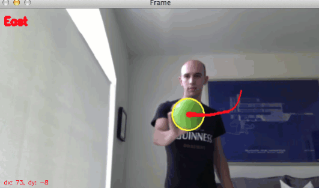
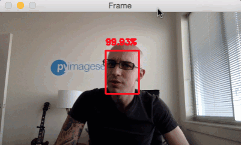

* Draft: 2021-01-26 (Tue)

# OpenCV

물체를 트래킹하거나 딥러닝을 이용한 객체 탐색을 할 때 OpenCV를 쓸 수 있습니다.

출처: [OpenCV Track Object Movement](https://www.pyimagesearch.com/2015/09/21/opencv-track-object-movement/), Adrian Rosebrock, pyimagesearch

출처: [Face detection with OpenCV and deep learning](https://www.pyimagesearch.com/2018/02/26/face-detection-with-opencv-and-deep-learning/), Adrian Rosebrock, pyimagesearch

