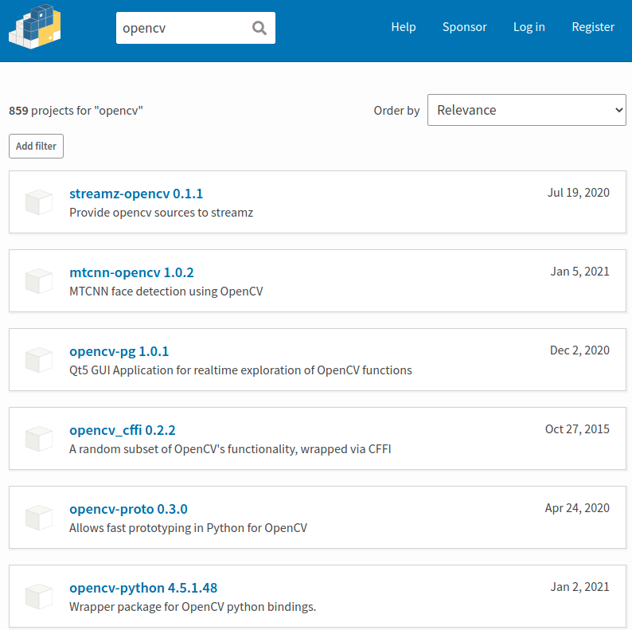
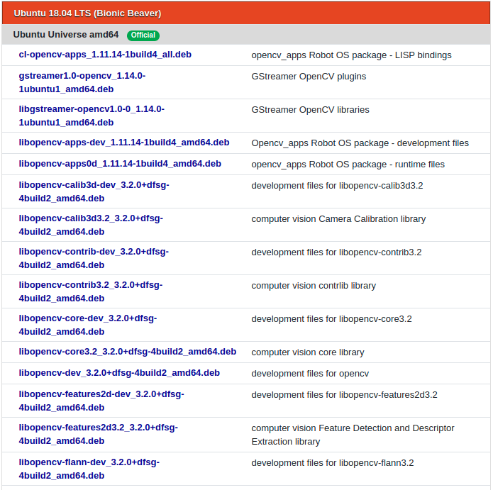

# OpenCV 설치하기

## 개요

파이썬에서 `cv2` 패키지를 사용하려면 에러가 발생합니다.

```bash
$ python
Python 3.8.5 (default, Sep  4 2020, 07:30:14) 
[GCC 7.3.0] :: Anaconda, Inc. on linux
Type "help", "copyright", "credits" or "license" for more information.
>>> import cv2
Traceback (most recent call last):
  File "<stdin>", line 1, in <module>
ModuleNotFoundError: No module named 'cv2'
>>> 
```

사용하기 위해서 OpenCV를 설치합니다.

## 요약

설치에 성공한 명령어가 있는 Bash Script는 [Installation in Linux](https://docs.opencv.org/master/d7/d9f/tutorial_linux_install.html)의 Build with opencv_contrib와 Install의 명령어를 합친 것입니다.

### 설치 명령어

소스코드에서 직접 설치하기

```bash
$ chmod +x install_opencv_in_linux 
$ ./install_opencv_in_linux 
```

콘다 명령어로 설치하기

```bash
(base) $ conda install -c conda-forge opencv
```

### [install_opencv_in_linux](bash_scripts/install_opencv_in_linux)로 설치하기

```bash
# Installation in Linux
#   https://docs.opencv.org/master/d7/d9f/tutorial_linux_install.html

## Build core modules
### is not adapted.

## Build with opencv_contrib
### Install minimal prerequisites (Ubuntu 18.04 as reference)
sudo apt update && sudo apt install -y cmake g++ wget unzip

### Download and unpack sources
wget -O opencv.zip https://github.com/opencv/opencv/archive/master.zip
wget -O opencv_contrib.zip https://github.com/opencv/opencv_contrib/archive/master.zip
unzip opencv.zip
unzip opencv_contrib.zip
pkg-config
### Create build directory
mkdir -p build && cd build

### Configure
cmake -DOPENCV_EXTRA_MODULES_PATH=../opencv_contrib-master/modules ../opencv-master

### Build
cmake --build .

## Install
sudo make install
```

### 설치 시간 측정

`time`명령어를 써서 시간을 확인해보니 설치에 약 30분이 소요되었습니다.

```bash
(base) $ chmod +x install_opencv_in_linux 
(base) $ time ./install_opencv_in_linux 
  ...
(wd now: ~/github/tools/yolov3/bash_scripts)

real	35m38.499s
user	31m51.933s
sys	1m49.637s
(base) $
```

### 설치 확인

설치는 `python`명령어와 `pkg-config`명령어를 써서 확인할 수 있습니다.

설치되지 않은 경우는 

```bash
(base) $ python -c 'import cv2; print(cv2.__version__)'
Traceback (most recent call last):
  File "<string>", line 1, in <module>
ModuleNotFoundError: No module named 'cv2'
(base) $
```

```bash
(base) $ pkg-config --modversion opencv
Package opencv was not found in the pkg-config search path.
Perhaps you should add the directory containing `opencv.pc'
to the PKG_CONFIG_PATH environment variable
No package 'opencv' found
(base) $
```

와 같은 메세지가 출력됩니다. 

콘다 명령어로 설치할 경우

* 파이썬에서 import는 잘 되지만,

  ```bash
  (base) $ python -c 'import cv2; print(cv2.__version__)'
  4.2.0
  (base) $
  ```

  혹은

  ```bash
  (base) $ python
    ...
  >>> import cv2
  >>> exit()
  (base) $
  ```

* `pkg-config`는 에러가 발생합니다.

소스코드로 직접 컴파일했을 때

* 파이썬에서 import도 잘 되고
* `pkg-config`도 잘 동작했습니다. 예를 들면

```bash
(base) $ pkg-config --modversion opencv
3.2.0
(base) $ pkg-config --cflags opencv
-I/usr/include/opencv
(base) $ pkg-config --libs opencv
-lopencv_shape -lopencv_stitching -lopencv_superres 
  ...
-lopencv_core
$
```

> 주의: 웹문서 중 아래 명령어를 입력하는 경우를 봤습니다. 소스코드로 컴파일한 다음 위의 `pkg-config` 명령어가 잘 동작하더라도 아래 명령어는 실패합니다.
>
> ```bash
> (base) $ pkg-config --modversion opencv4
> Package opencv4 was not found in the pkg-config search path.
> Perhaps you should add the directory containing `opencv4.pc'
> to the PKG_CONFIG_PATH environment variable
> No package 'opencv4' found
> (base) $
> ```

## 공식 문서의 설치 관련 정보

우분투 18.04에 설치하기 위해서 웹검색을 하면 많은 문서들이 나옵니다. 다양한 것을 시도해서 CPU에서 동작은 하지만, NVIDIA GPU에서 동작하게 하는 것은 쉽지 않네요. 결국 공식 문서의 설치 관련 정보로 돌아왔습니다. 

공식 문서의 정보를 정리했습니다. 정리된 것도 꽤 복잡한데 나열한 이유는 openCV 설치가 꽤 까다롭고 시간이 걸리는 작업이라는 주변의 의견이 있어서 입니다. 저 또한 직접 경험을 했기 때문에 머리 속에서 이해가 된 내용을 정리할 필요가 생겼습니다. 

와공식 홈페이지 https://opencv.org/ 의 [Introduction to OpenCV](https://docs.opencv.org/master/df/d65/tutorial_table_of_content_introduction.html)에 있는 설치 관련된 링크입니다.

> - [OpenCV installation overview](https://docs.opencv.org/master/d0/d3d/tutorial_general_install.html)
> - [OpenCV configuration options reference](https://docs.opencv.org/master/db/d05/tutorial_config_reference.html)
>
> ##### Linux
>
> - [Installation in Linux](https://docs.opencv.org/master/d7/d9f/tutorial_linux_install.html)
>
> ##### Windows
>
> - [Installation in Windows](https://docs.opencv.org/master/d3/d52/tutorial_windows_install.html)
>
> ##### Other platforms
>
> - [Installation in MacOS](https://docs.opencv.org/master/d0/db2/tutorial_macos_install.html)

[OpenCV installation overview](https://docs.opencv.org/master/d0/d3d/tutorial_general_install.html)에는 설치 과정에 관한 간략한 설명이 있습니다.

>  Two ways of installing OpenCV 
>
>  * download **prebuilt version** for your platform
>  * **build from sources**
>
>  **Prebuilt version**
>
>  * Packages by OpenCV core team
>   * GitHub releases: https://github.com/opencv/opencv/releases
>   * SourceForge.net: https://sourceforge.net/projects/opencvlibrary/files/
>   * published for
>     * Android
>     * iOS
>     * Windows
>   * they do not contain `opencv_contrib` modules.
>
>  **Third-party packages**
>
>   * System packages in popular Linux distributions (https://pkgs.org/search/?q=opencv)
>   * PyPI (https://pypi.org/search/?q=opencv)
>   * Conda (https://anacoThird-party packages**nda.org/search?q=opencv)
>   * Conan (https://github.com/conan-community/conan-opencv)
>   * vcpkg (https://github.com/microsoft/vcpkg/tree/master/ports/opencv)
>   * NuGet (https://www.nuget.org/packages?q=opencv)
>   * Brew (https://formulae.brew.sh/formula/opencv)
>   * Maven (https://search.maven.org/search?q=opencv)
>
>  **Build from sources**
>
>  * The steps are summarized below.
>   * Step 1: Get software sources
>   * Step 2: Configure
>   * Step 3: Build
>   * Step 4: Install
>  * For details, refer to [OpenCV installation overview > Build from sources](https://docs.opencv.org/master/d0/d3d/tutorial_general_install.html).


## 공식 문서의 Third-party packages에 있는 내용

Third-party package를 제공하는 3가지 경우 중, Conda를 제외하고는 너무 많은 패키지가 있어서 선택도 어렵습니다. Conda를 추천합니다.

### Conda로 설치하기

 * Conda (https://anaconda.org/search?q=opencv)
   * [conda-forge / packages / opencv 4.5.0](https://anaconda.org/conda-forge/opencv)

> To install this package with conda run one of the following:
> `conda install -c conda-forge opencv`
> `conda install -c conda-forge/label/gcc7 opencv`
> `conda install -c conda-forge/label/broken opencv`
> `conda install -c conda-forge/label/cf201901 opencv`
> `conda install -c conda-forge/label/cf202003 opencv`

```bash
(base) $ conda install -c conda-forge -y opencv
```

로 설치를 합니다. 설치 후 동작을 확인합니다.

```bash
(base) $ python -c 'import cv2; print(cv2.__version__)'
4.2.0
(base) $
```

파이썬에서는 인식되지만 `pkg-config`명령어로는 동작하지 않습니다.

```bash
(base) $ pkg-config --modversion opencv4
Package opencv4 was not found in the pkg-config search path.
Perhaps you should add the directory containing `opencv4.pc'
to the PKG_CONFIG_PATH environment variable
No package 'opencv4' found
(base) $
```

> 주의:`opencv4`가 아닌 `opencv`로 변경해야 합니다.

Google search: opencv pkg-config

* [pkg-config can't find opencv](https://stackoverflow.com/questions/15113753/pkg-config-cant-find-opencv)

  > - You need to have the package `libopencv-dev` installed. – user1252091 [Feb 27 '13 at 13:59](https://stackoverflow.com/questions/15113753/pkg-config-cant-find-opencv#comment21267327_15113753)
  >
  > - I had only installed libcv, I added libopencv and it worked. Thanks a lot. – [Clement Roblot](https://stackoverflow.com/users/1696480/clement-roblot) [Feb 27 '13 at 14:18](https://stackoverflow.com/questions/15113753/pkg-config-cant-find-opencv#comment21268124_15113753) 
  > - It seems you have found your answer. Could you please answer your own question and accept it. – [aiao](https://stackoverflow.com/users/1009248/aiao) [Jan 14 '14 at 15:41](https://stackoverflow.com/questions/15113753/pkg-config-cant-find-opencv#comment31773833_15113753)
  > - Installing that package solved my isssue – [Mitro](https://stackoverflow.com/users/1223817/mitro) [Jan 18 '15 at 13:36](https://stackoverflow.com/questions/15113753/pkg-config-cant-find-opencv#comment44408185_15113753)

```bash
$ sudo apt install -y libopencv-dev
```

를 설치해도 문제해결이 안 됐습니다.

```bash
$ pkg-config --cflags --libs opencv4
```

### Python 패키지로 설치하기

* PyPI (https://pypi.org/search/?q=opencv)

파이썬 패키지도 859로 많이 있습니다.



한 가지 유의해야 할 점이 이 중의 `opencv-python`입니다.

```bash
$ pip install opencv-python
```

로 간단하게 설치가 되고 파이썬을 지원합니다. 하지만 CPU만 지원하고 GPU에 사용하려면 수동으로 빌드해야 하므로 번거로워집니다.

> **Unofficial** pre-built CPU-only OpenCV packages for Python.
>
> Check the manual build section if you wish to compile the bindings from source to enable additional modules such as CUDA.
>
> 출처: [opencv-python 4.5.1.48](https://pypi.org/project/opencv-python/)

### 리눅스 패키지

* System packages in popular Linux distributions (https://pkgs.org/search/?q=opencv)
  * Search Results for opencv


에 많은 `.dpkg` 파일 중 일부입니다.



너무 많은 패키지가 있어서 선택도 어렵습니다.

## 튜토리얼

[How to install OpenCV 4 on Ubuntu](https://www.pyimagesearch.com/2018/08/15/how-to-install-opencv-4-on-ubuntu/), 2018-08-15

## 부록. 설치된 라이브러리 보는 방법

Ubuntu 18.04에서 설치된 라이브러리를 다음 명령어로 볼 수 있습니다.

```bash
$ ls /usr/lib/x86_64-linux-gnu | grep libopencv
libopencv_aruco.a
  ...
libopencv_xphoto.so.3.2.0
$
```

